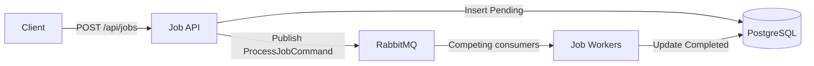

# Distributed Task Processor

[](https://github.com/EvelynPryadkin/distributed-task-processor/actions/workflows/ci.yml)

I built this project to show a complete background-job flow without hiding the infrastructure behind hosted services. It uses .NET 8, RabbitMQ, PostgreSQL, MassTransit, and Entity Framework Core.

The API accepts work over HTTP and stores a durable `Pending` job record before publishing a message. Worker instances compete for messages from RabbitMQ, process each job, and update its database status to `Completed`. The repository includes Docker Compose for local use, Kubernetes manifests, and a GitHub Actions pipeline that builds the solution and scans the API image with Trivy.

## How it works



1. `JobApi` validates the request.
2. The API inserts a `JobRecord` with a `Pending` status.
3. The API publishes a `ProcessJobCommand` through MassTransit.
4. One worker receives the command from `process-job-queue`.
5. The worker simulates two seconds of work and changes the status to `Completed`.

Two worker replicas can run at the same time. RabbitMQ delivers each queued message to one consumer rather than sending the same job to both.

## Technology

| Area | Technology |
| --- | --- |
| API and worker | .NET 8 / ASP.NET Core |
| Messaging | MassTransit 8.1.3 and RabbitMQ |
| Database | PostgreSQL 15 |
| Data access | Entity Framework Core and Npgsql |
| Local infrastructure | Docker Compose |
| Orchestration | Kubernetes manifests |
| CI and security | GitHub Actions and Trivy |

## Run locally with Docker

### Prerequisites

- Docker Desktop with Docker Compose
- .NET 8 SDK for applying the EF Core migration
- Git

### 1. Clone the repository

```bash
git clone https://github.com/EvelynPryadkin/distributed-task-processor.git
cd distributed-task-processor
```

### 2. Build and start the stack

```bash
docker compose up --build -d
```

This starts four containers:

| Service | Local address | Credentials |
| --- | --- | --- |
| Job API | `http://localhost:8080` | None |
| RabbitMQ | `localhost:5672` | `guest` / `guest` |
| RabbitMQ UI | `http://localhost:15672` | `guest` / `guest` |
| PostgreSQL | `localhost:5432` | `postgres` / `postgres` |

The default PostgreSQL database is named `jobs`.

### 3. Apply the database migration

Install the EF CLI once if it is not already available:

```bash
dotnet tool install --global dotnet-ef --version 8.0.11
```

Apply the checked-in migration:

```bash
dotnet ef database update --project JobApi/JobApi.csproj
```

The migration creates the `Jobs` table used by both the API and workers.

### 4. Check the API

```bash
curl -i http://localhost:8080/health
```

Expected response:

```text
HTTP/1.1 200 OK
```

### 5. Submit a job

The following commands generate a new ID so the request can be repeated without causing a duplicate conflict:

```bash
JOB_ID=$(uuidgen | tr '[:upper:]' '[:lower:]')

curl -i -X POST http://localhost:8080/api/jobs \
  -H "Content-Type: application/json" \
  -d "{\"jobId\":\"$JOB_ID\",\"payload\":\"Generate monthly report\",\"createdAt\":\"2026-09-02T10:00:00Z\"}"
```

The API returns `202 Accepted`. After approximately two seconds, the worker changes the database status from `Pending` to `Completed`.

### 6. Verify the result

Check the worker logs:

```bash
docker compose logs --tail=50 job-worker
```

Look up the submitted job in PostgreSQL:

```bash
docker compose exec postgres psql -U postgres -d jobs \
  -c "SELECT \"Id\", \"Payload\", \"Status\", \"CreatedAt\" FROM \"Jobs\" WHERE \"Id\" = '$JOB_ID';"
```

The final status should be `Completed`.

## API behavior

### `GET /health`

Returns `200 OK` when the API process is running.

### `POST /api/jobs`

Example body:

```json
{
  "jobId": "3fa85f64-5717-4562-b3fc-2c963f66afa6",
  "payload": "Generate monthly report",
  "createdAt": "2026-09-02T10:00:00Z"
}
```

Common responses:

| Status | Meaning |
| --- | --- |
| `202 Accepted` | The job was stored and published. |
| `400 Bad Request` | JSON is malformed or a required value is missing or empty. |
| `409 Conflict` | A job with the same `JobId` already exists. |

## Useful Docker commands

View container health and exposed ports:

```bash
docker compose ps
```

Follow API and worker logs:

```bash
docker compose logs -f job-api job-worker
```

Inspect RabbitMQ queue depth:

```bash
docker compose exec rabbitmq \
  rabbitmqctl list_queues name messages_ready messages_unacknowledged consumers
```

Restart one service:

```bash
docker compose restart job-worker
```

Stop the stack while preserving PostgreSQL data:

```bash
docker compose down
```

Reset the entire local environment, including the PostgreSQL volume:

```bash
docker compose down -v
```

The final command permanently removes local database data.

### Build images individually

The Dockerfiles use multi-stage .NET 8 Alpine builds and run the applications as a non-root user.

```bash
docker build -t job-api:latest -f JobApi/Dockerfile .
docker build -t job-worker:latest -f JobWorker/Dockerfile .
```

The build context must be the repository root because both projects reference `SharedContracts`.

## Configuration

.NET converts double underscores in environment variable names into configuration sections.

| Environment variable | Purpose | Docker Compose value |
| --- | --- | --- |
| `RabbitMq__Host` | RabbitMQ hostname | `rabbitmq` |
| `RabbitMq__Username` | RabbitMQ user | `guest` |
| `RabbitMq__Password` | RabbitMQ password | `guest` |
| `ConnectionStrings__DefaultConnection` | PostgreSQL connection | `Host=postgres;Port=5432;Database=jobs;Username=postgres;Password=postgres` |

The checked-in credentials are intended only for local development. Use a secret manager or Kubernetes Secrets outside a local environment.

## Kubernetes

The `k8s` folder contains manifests for:

- RabbitMQ with a ClusterIP service and persistent volume
- PostgreSQL with a ClusterIP service and persistent volume
- Two API replicas behind a LoadBalancer service
- Two competing worker replicas

For Docker Desktop Kubernetes, build the local images first:

```bash
docker build -t job-api:latest -f JobApi/Dockerfile .
docker build -t job-worker:latest -f JobWorker/Dockerfile .
kubectl apply -f k8s/
```

Apply the migration to the Kubernetes database before submitting jobs. In one terminal:

```bash
kubectl port-forward service/postgres 15432:5432
```

In a second terminal:

```bash
ConnectionStrings__DefaultConnection="Host=localhost;Port=15432;Database=jobs;Username=postgres;Password=postgres" \
  dotnet ef database update --project JobApi/JobApi.csproj
```

To access the API locally, keep this command running in one terminal:

```bash
kubectl port-forward service/job-api 18080:8080
```

Then call `http://localhost:18080` from another terminal. Port `18080` avoids a conflict when the Docker Compose API is already using port `8080`.

For a remote cluster, push the API and worker images to a registry and replace `job-api:latest` and `job-worker:latest` in the manifests with the registry image names.

## CI pipeline

Pushes and pull requests to `main` run the workflow in `.github/workflows/ci.yml`. It:

1. Restores NuGet dependencies.
2. Builds the solution in Release mode.
3. Builds the API Docker image.
4. Scans operating-system and .NET packages with Trivy.
5. Fails on fixed HIGH or CRITICAL vulnerabilities.

## Repository layout

```text
JobApi/           HTTP API, EF context, migration, and API Dockerfile
JobWorker/        MassTransit consumer, background worker, and worker Dockerfile
SharedContracts/  Message contract and shared job entity
k8s/              Kubernetes deployments, services, and persistent volumes
.github/workflows CI workflow and Trivy image scan
docker-compose.yml Local API, worker, RabbitMQ, and PostgreSQL stack
```

## Current tradeoffs

This project keeps the moving parts visible rather than hiding them behind a platform. A few production concerns are deliberately left as next steps:

- Database migrations are an explicit deployment step.
- The API stores the job before publishing, but it does not yet use a transactional outbox. A broker failure between those operations can leave a job in `Pending`.
- The health endpoint reports API liveness; it does not currently include PostgreSQL or RabbitMQ readiness.
- The repository does not yet contain an automated integration-test project. The Docker and Kubernetes paths have been exercised end to end manually.
- Local credentials in Compose and the Kubernetes examples should be replaced by managed secrets in a real environment.

The next work I would prioritize is an outbox, retry and dead-letter policies, dependency health checks, metrics and tracing, and automated integration tests.
